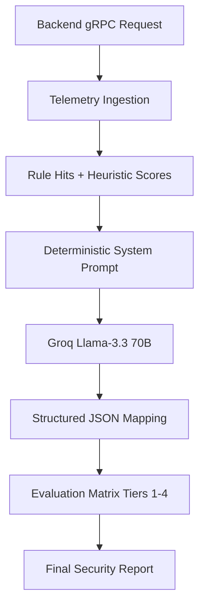

# SecureMail AI (Python)

A gRPC microservice providing email security analysis using LangChain and Groq.

## ✅ Run Options

### 1. Via Turborepo (Root)
Run this service along with the Backend:
```bash
npm run dev:api
```

## 🛡️ Deep Analysis: AI Security Reasoning

SecureMail-Ai is not a simple LLM wrapper; it is a **Deterministic Security Reasoning Engine** designed to convert raw technical telemetry into a clinical security verdict.

### 🧠 Core Architecture
It uses **LangChain** to orchestrate interactions with the **Groq (Llama-3.3-70B)** infrastructure, providing sub-second inference speeds for complex reasoning tasks.



### ⚖️ Technical Threat Matrix (Tiers)
The agent strictly evaluates emails based on a predefined TIER system:
- **TIER 4 (CRITICAL)**: Positive malware verdict or critical rule hits (e.g., `credential_harvesting`).
- **TIER 3 (HIGH)**: Advanced spoofing (punycode, homoglyphs) or high-confidence phishing scores.
- **TIER 2 (MEDIUM)**: Spam, scams (lottery/prizes), or social engineering attempts.
- **TIER 1 (SAFE)**: Verified transactional or professional communications.

### 🔍 Key Features
- **Bounded Concurrency**: Uses semaphores to prevent resource exhaustion during heavy bursts.
- **Zero-Trust Suggestions**: Generates first-person defensive reply drafts for suspicious emails.
- **Behavioral Anomaly Detection**: Compares current intent against historical sender topics.

---

## 🛠️ Tech Stack
- **Language**: Python 3.14+
- **Framework**: LangChain Core
- **LLM Provider**: Groq (Llama-3 model family)
- **Interface**: gRPC (Google Remote Procedure Call)
- **Port**: `50051` (gRPC)
- **Key**: `GROQ_API_KEY` is required for analysis to succeed.

---

### 2. Manual Execution
Requires Python 3.14+ (compatible with 3.11+).

1. **Environment**:
   ```bash
   python -m venv .venv
   source .venv/bin/activate  # Or .venv\Scripts\activate on Windows
   pip install -r requirements.txt
   ```
2. **Settings**: Create a `.env` file and add your `GROQ_API_KEY`.
3. **Run**:
   ```bash
   python app/main.py
   ```

## ⚙️ Configuration
- **Port**: `50051` (gRPC)
- **Key**: `GROQ_API_KEY` is required for analysis to succeed.

---

## 🏗️ Synchronization
This service uses Protobuf stubs generated from `contracts/ai-agent.proto`. To regenerate stubs after a contract change:
```bash
# From root
npx turbo run dev --filter=ai
```
(Or use the local `tools/regen_proto.ps1` on Windows).
