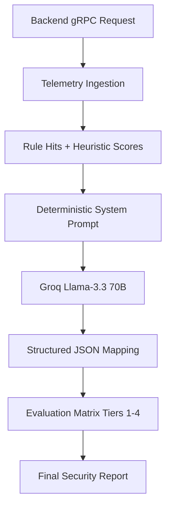

# SecureMail-Ai 🤖

> A deterministic AI reasoning engine — not a simple LLM wrapper. Converts raw email telemetry into clinical security verdicts using LangChain and Groq (Llama-3.3-70B).

---

## 📋 Table of Contents

- [How the AI Reasoning Works](#-how-the-ai-reasoning-works)
- [Threat Tier Matrix](#-threat-tier-matrix)
- [Quick Start](#-quick-start)
- [Configuration](#-configuration)
- [Tech Stack](#-tech-stack)

---

## 🧠 How the AI Reasoning Works

The service receives raw security telemetry from the Backend via gRPC and produces a structured threat verdict.



### Key Capabilities

**Bounded Concurrency** — Uses semaphores to prevent resource exhaustion during heavy traffic bursts, with a configurable `AI_MAX_CONCURRENT` limit.

**Zero-Trust Reply Drafts** — Generates first-person defensive reply suggestions for suspicious emails, helping users respond safely.

**Behavioral Anomaly Detection** — Compares the current email's intent against the sender's historical communication patterns to detect outliers.

---

## ⚖️ Threat Tier Matrix

Every email is classified into one of four tiers:

| Tier | Level | Trigger Conditions |
|---|---|---|
| **TIER 4** | 🔴 CRITICAL | Positive malware verdict or critical rule hits (e.g., `credential_harvesting`) |
| **TIER 3** | 🟠 HIGH | Advanced spoofing (punycode, homoglyphs) or high-confidence phishing scores |
| **TIER 2** | 🟡 MEDIUM | Spam, scams (lottery/prizes), or social engineering attempts |
| **TIER 1** | 🟢 SAFE | Verified transactional or professional communications |

---

## 🚀 Quick Start

### Option A — Via Root Setup Script (Recommended)

From the root `Securemail/` folder:

```bash
./setup.sh      # Mac/Linux
setup.bat       # Windows
```

This handles everything automatically including the `GROQ_API_KEY` reminder.

---

### Option B — Via Turborepo

```bash
# From root
pnpm dev:api
```

---

### Option C — Manual Execution

Requires Python 3.11+.

```bash
# 1. Create virtual environment
python -m venv .venv
source .venv/bin/activate        # Mac/Linux
# or
.venv\Scripts\activate           # Windows

# 2. Install dependencies
pip install -r requirements.txt

# 3. Create .env file
cp .env.docker.example .env

# 4. Add your Groq API key to .env
# GROQ_API_KEY=your-key-here

# 5. Run
python app/main.py
```

---

## ⚙️ Configuration

Copy the example file and fill in your key:

```bash
cp .env.docker.example .env.docker
```

| Variable | Required | Description |
|---|---|---|
| `GROQ_API_KEY` | ✅ Yes | Get from [console.groq.com/keys](https://console.groq.com/keys) |
| `AI_PORT` | No | gRPC port (default: `50051`) |
| `AI_MAX_CONCURRENT` | No | Max parallel analyses (default: `4`) |
| `AI_MAX_BODY_CHARS` | No | Max email body length (default: `120000`) |
| `LOG_LEVEL` | No | Logging verbosity (default: `INFO`) |

> **Without `GROQ_API_KEY`** the service starts but returns degraded verdicts — the Backend handles this gracefully via the security pipeline.

---

## 🛠️ Tech Stack

| Layer | Technology |
|---|---|
| **Language** | Python 3.11+ |
| **AI Framework** | LangChain Core |
| **LLM Provider** | Groq (Llama-3.3-70B) |
| **Interface** | gRPC |
| **Port** | `50051` |

---

## 🏗️ Proto Synchronization

This service uses pre-generated Protobuf stubs from `contracts/ai-agent.proto`. To regenerate after a contract change:

```bash
# From root
npx turbo run dev --filter=ai

# Or on Windows
tools/regen_proto.ps1
```

---

## ⚠️ Troubleshooting

### Service starts but analysis always fails

Your `GROQ_API_KEY` is missing or invalid. Check:

```bash
cat .env.docker | grep GROQ_API_KEY
```

Get a key from [console.groq.com/keys](https://console.groq.com/keys) — free tier is available.

### Healthcheck fails in Docker

The `nc` command isn't available in the Python image. The `docker-compose.yml` uses Python's socket module for the healthcheck instead — this is already handled.
